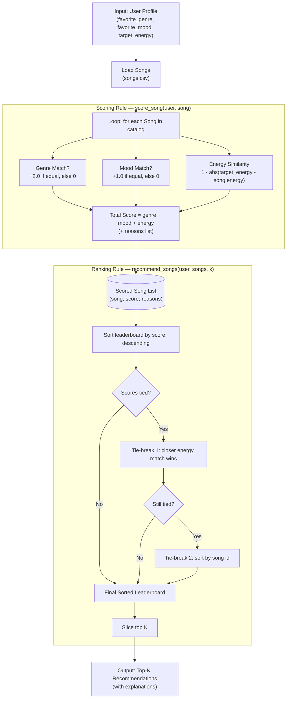
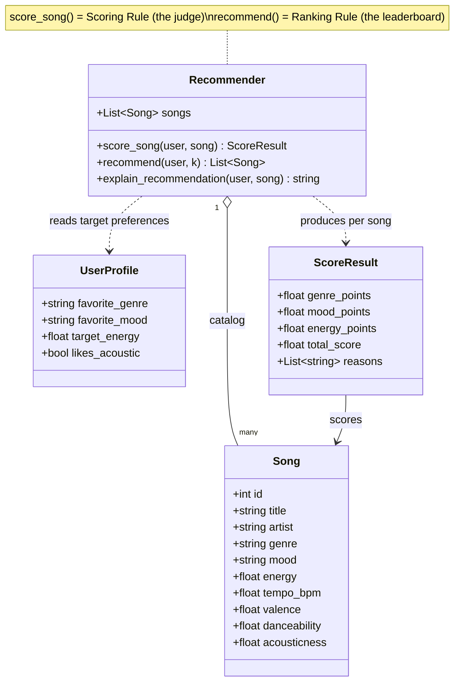

# Data Flow: Music Recommender

```mermaid
flowchart TD
    A["Input: User Profile<br/>(favorite_genre, favorite_mood, target_energy)"] --> B["Load Songs<br/>(songs.csv)"]
    B --> C["Loop: for each Song in catalog"]

    subgraph ScoringRule["Scoring Rule — score_song(user, song)"]
        C --> D["Genre Match?<br/>+2.0 if equal, else 0"]
        C --> E["Mood Match?<br/>+1.0 if equal, else 0"]
        C --> F["Energy Similarity<br/>1 - abs(target_energy - song.energy)"]
        D --> G["Total Score = genre + mood + energy<br/>(+ reasons list)"]
        E --> G
        F --> G
    end

    G --> H[("Scored Song List<br/>(song, score, reasons)")]

    subgraph RankingRule["Ranking Rule — recommend_songs(user, songs, k)"]
        H --> I["Sort leaderboard by score, descending"]
        I --> J{"Scores tied?"}
        J -->|Yes| K["Tie-break 1: closer energy match wins"]
        K --> L{"Still tied?"}
        L -->|Yes| M["Tie-break 2: sort by song id"]
        J -->|No| N["Final Sorted Leaderboard"]
        L -->|No| N
        M --> N
        N --> O["Slice top K"]
    end

    O --> P["Output: Top-K Recommendations<br/>(with explanations)"]
```

## Class Diagram (Attributes & Methods)

```mermaid
classDiagram
    class Song {
        +int id
        +string title
        +string artist
        +string genre
        +string mood
        +float energy
        +float tempo_bpm
        +float valence
        +float danceability
        +float acousticness
    }

    class UserProfile {
        +string favorite_genre
        +string favorite_mood
        +float target_energy
        +bool likes_acoustic
    }

    class ScoreResult {
        +float genre_points
        +float mood_points
        +float energy_points
        +float total_score
        +List~string~ reasons
    }

    class Recommender {
        +List~Song~ songs
        +score_song(user, song) ScoreResult
        +recommend(user, k) List~Song~
        +explain_recommendation(user, song) string
    }

    Recommender "1" o-- "many" Song : catalog
    Recommender ..> UserProfile : reads target preferences
    Recommender ..> ScoreResult : produces per song
    ScoreResult --> Song : scores

    note for Recommender "score_song() = Scoring Rule (the judge)\nrecommend() = Ranking Rule (the leaderboard)"
```
